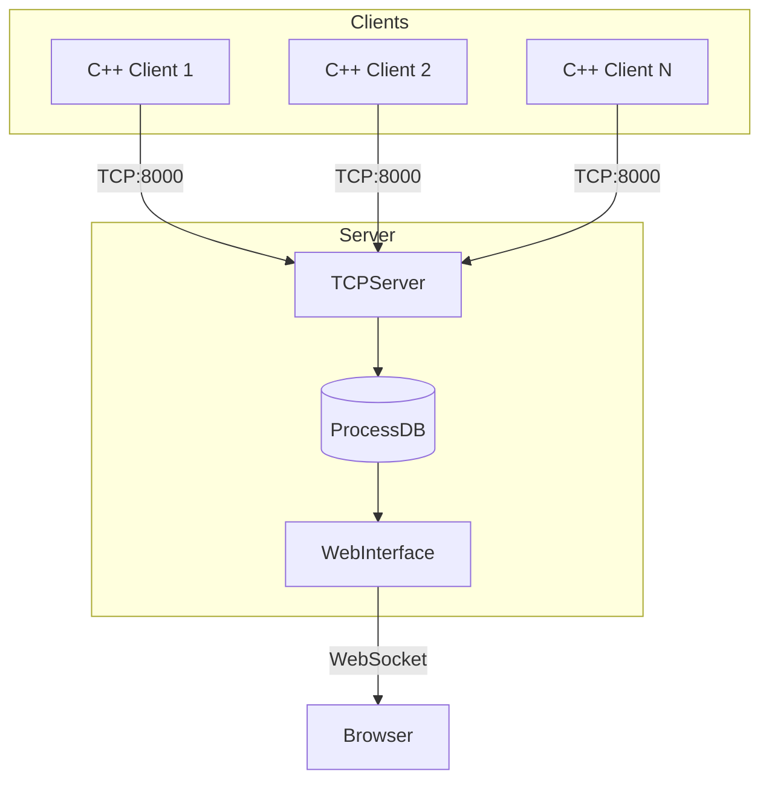
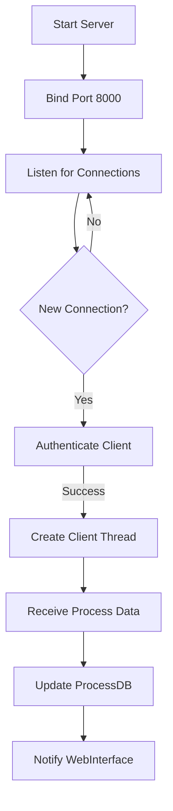
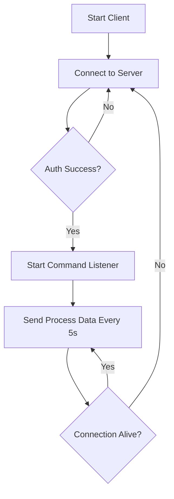
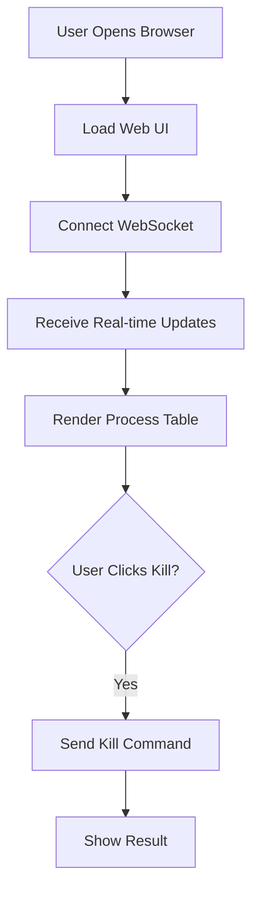
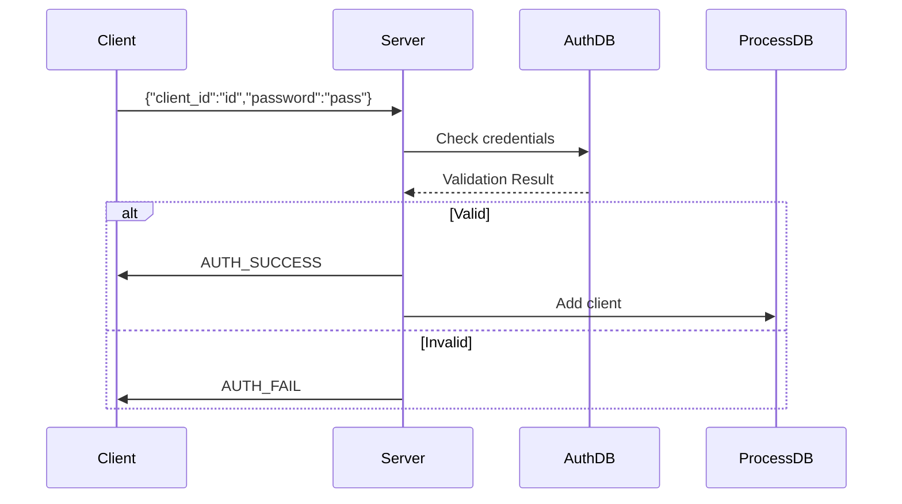
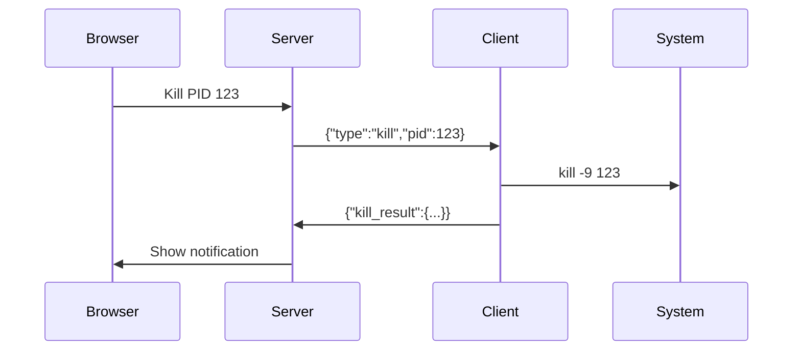
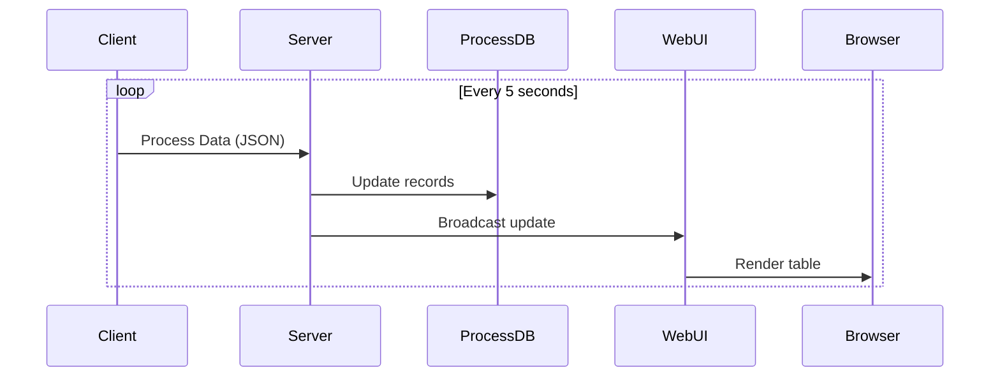

# Process Monitoring System
## Environment
OS: Ubuntu 24.04

### Server
$ python3 -m venv venv \
$ source venv/bin/activate \
$ pip install flask flask-socketio eventlet

### Client
CMake version ≥ 3.10 \
CMD: \
$ sudo apt update \
$ sudo apt install build-essential cmake libboost-all-dev -y

## Tutorial Run
### Server
$ cd server \
$ python app.py 

### Client
Mỗi client, chạy dòng lệnh \
$ cd client/build \
$ ./client --client_id client(1-10) --password password --server_host <host server> --server_port 8000

-----
NOTE:  \
Source build step client (can if): \
$ cd client \
$ mkdir -p build \
$ cd build \
$ cmake .. \
$ make

Nếu build lại client cần rf -rm build, sau đó mkdir build và cd build, chạy lệnh cmake ..

Các app_1,app_2 ... \
=> Chạy ./app_1 ... Nếu cần chạy để mô phỏng tiến trình. \
Các app này mô phỏng 1 process đang chạy. Để phục vụ cho test kill tiến trình \

Search tên app trên thanh tìm kiếm để kill tiến trình

## System Architecture

## Core Modules Flow
### TCP Server Module

### Client Module

### Web Interface Module

## Detailed Component Flows
### Authentication Flow

### Kill Process Flow

### Process Monitoring Flow

