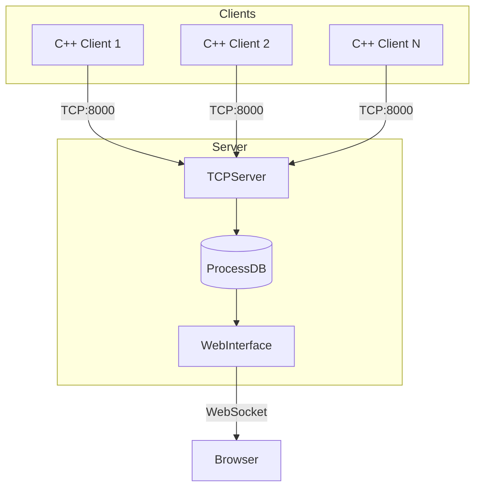

# Process Monitoring System

## System Architecture

```mermaid
flowchart TD
    subgraph Clients
        C1[C++ Client 1]
        C2[C++ Client 2]
        CN[C++ Client N]
    end

    subgraph Server
        TCPServer
        WebInterface
        ProcessDB[(ProcessDB)]
    end

    C1 -->|TCP:8000| TCPServer
    C2 -->|TCP:8000| TCPServer
    CN -->|TCP:8000| TCPServer
    WebInterface -->|WebSocket| Browser
    TCPServer --> ProcessDB
    ProcessDB --> WebInterface
```
